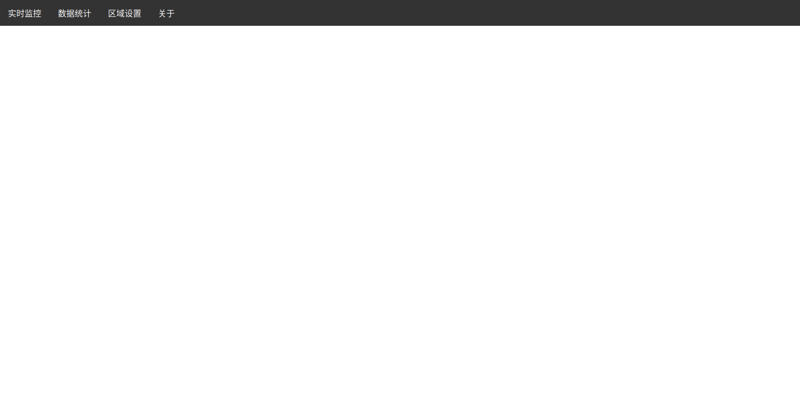
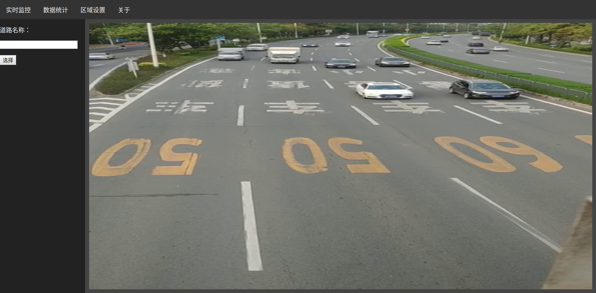
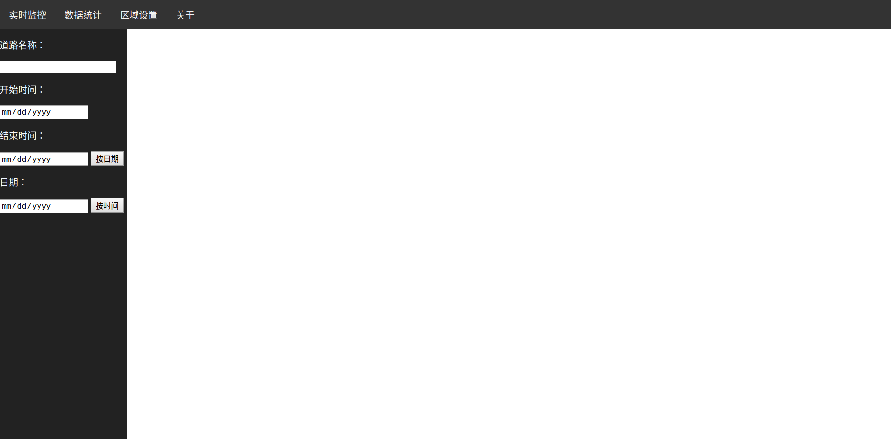
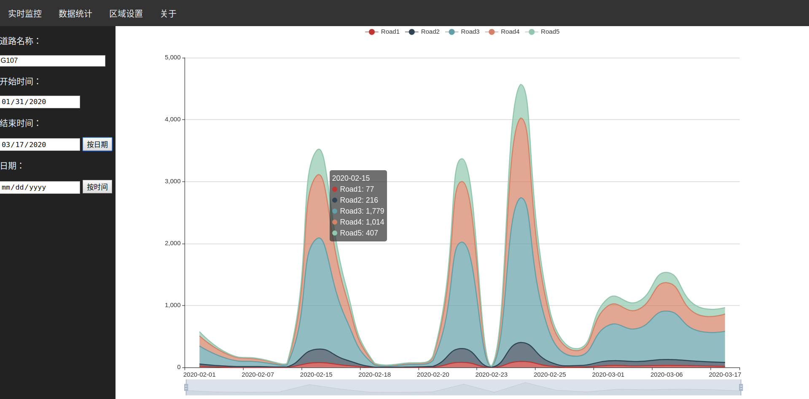
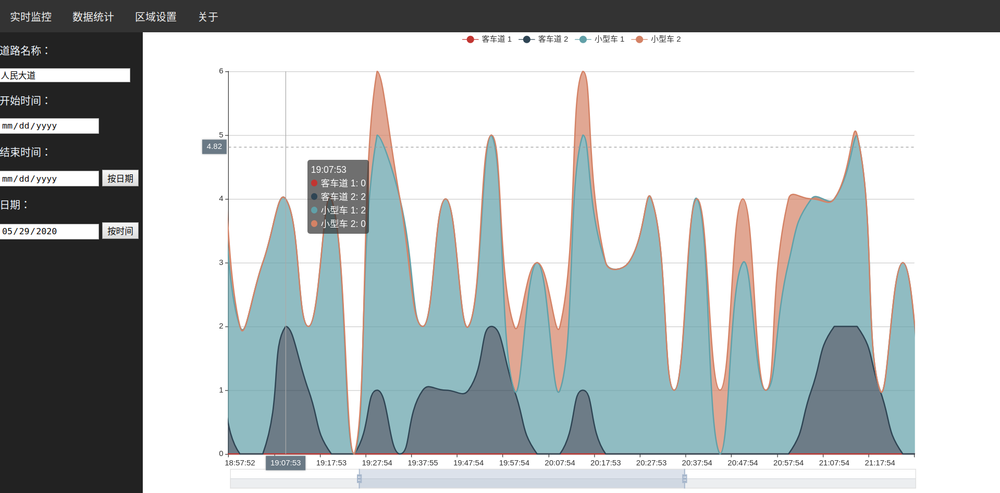
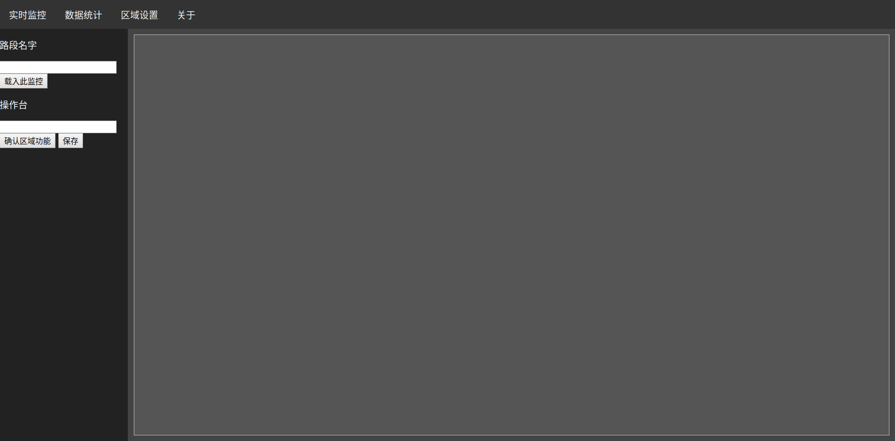
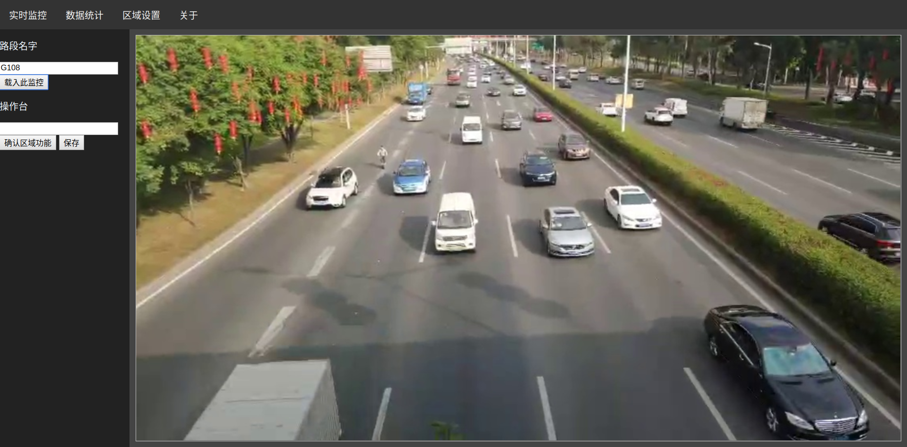
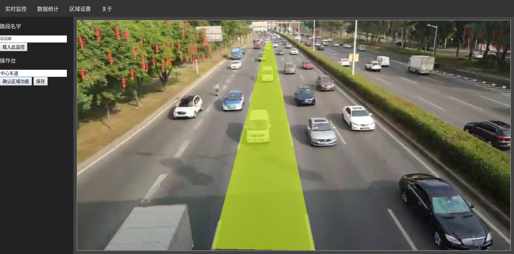
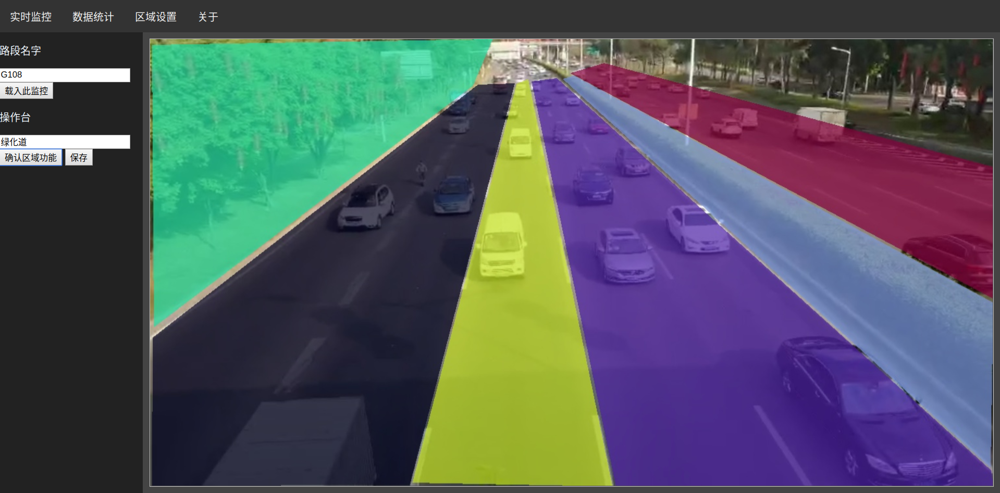

# 项目介绍
此项目为北京交通大学大学生创新创业项目，项目名称为“智能路况监测员”，版权及最终解释权归周航老师、廖琛、陈辰、张楚四人人以及北京交通大学所有。在此特别感谢周航老师以及北京交通大学对我们的支持与帮助。
# 项目使用
## 环境配置
本项目主要运行在Docker环境下，请先安装Docker，不同操作系统安装Docker的方式不大一样，请根据自己的系统自行寻找安装教程进行安装。本程序测试环境为Ubuntu 18.04 LTS，根据Docker的特性，绝大部分系统应该都可以正常使用。

本项目基于Docker中的Ubuntu 18.04镜像，在安装时会自动从服务器下载。由于Docker默认的服务器在国外，下载速度较慢，如有需要请自行把镜像服务器地址改为国内地址。本人已将镜像中的apt源改为阿里云的源，如有特殊需求，请自行到Dockerfile中更改。

本项目将会创造5个Docker镜像，其中的主镜像配置文件位于
* Docker/Dockerfile

其余四个镜像均基于主镜像，其配置文件地址为
* App/Lane_Line_Recogniton/docker/Dockerfile
* App/Server/docker/Dockerfile
* App/Vehicle_Identification/docker/Dockerfile
* App/Vitual_Monitor/docker/Dockerfile

本项目默认端口为10，其配置位于文件
* run

如有其他需求请自行修改

本项目安装脚本基于bash，如果无bash请修改“run”文件或者根据“run”文件自行配置安装
## 安装
### 修改run脚本权限（可选）
```shell
 chmod a+x run
 ```

### 运行安装程序
```shell 
./run install
```

如果需要安装虚拟监控摄像头，则使用
```shell
./run install -v
```

下面的命令只要是安装了虚拟监控摄像头，都需要额外加上 “-v“ 这一参数的指令，后面将**不再具体说明**。

（虚拟监控摄像头是指在没有真实摄像头接口的情况下，使用虚拟监控摄像头来模拟实际监控摄像头的情况，一般情况下均需要安装，只有在实际生产环境下配置好了监控摄像头以及一系列相应的接口后才可以不使用虚拟监控摄像头。虚拟监控摄像头会循环播放内置的视频文件并输出，从而模拟真实监控摄像头的情况）

接下来程序会自动安装并在CLI上显示进度，请耐心等待。
### 更多命令说明
启动程序
```shell
./run start
```

停止程序
```shell
./run stop
```
重启程序
```shell
./run restart 
```

卸载程序
```shell
./run uninstall
```
帮助
```shell
./run help
```

## 程序运行
### 前置条件
在执行启动命令
```bash
./run start
或
./run start -v
```
之后，即可通过网页启动，为了安全，默认仅通过本地地址[http://127.0.0.1:10/]()启动，若需要通过外网访问，请修改run文件里的配置。
### 车辆识别
程序启动后，便会自动开始进行车辆识别并统计。
### 初始界面
使用任意浏览器（推荐使用Google Chrome）打开[http://127.0.0.1:10/]()进入客户端，可在上方的选项中选择各功能。


### 实时监控界面
点击实时监控即可看到实时监控界面



在左侧输入道路名称并点击输入即可切换道路，如果是虚拟监控摄像头，所有道路名称在
* Share/Vitual_Monitor_Video

文件路径下查找，若为实际监控摄像头，则根据实际提供的信息查找。

### 数据统计界面
点击数据统计即可看到数据统计界面



#### 模式一：按日期统计模式

在左侧输入道路名称，并选择“开始时间”和“结束时间”，点击“按日期”，即可得到按日统计的统计结果。


#### 模式一：按时间统计模式

在左侧输入道路名称，并选择“日期”，点击“按时间”，即可得到按时间统计的统计结果。



#### 统计数据操作

得到统计结果后，可在统计图上筛选时间、日期以及区域名称。

### 区域设置界面
点击区域设置即可看到区域设置界面。



在左侧输入路段名称并点击“载入次监控”，便可得到监控当前帧的图像。



在图像中点击，两个点击点之间会出现一条红线，这些红线围起来的区域便是你想要命名的区域。


在操作台输入你想对该区域的命名，点击“确认区域功能”，程序便会将这一区域用颜色标记出来。



在确认完所有区域后，点击“保存”即可将区域信息保存，数据文件将存入相应文件夹内。



# 项目说明
## 技术说明
### Docker技术
本项目采用了Docker技术。借助 Docker，我们可将容器当做轻巧、模块化的虚拟机使用。同时，我们还将获得高度的灵活性，从而实现对容器的高效创建、部署及复制，并能将其从一个环境顺利迁移至另一个环境。经过了我们多次的尝试，我们编写的Dockerfile可以安装完即可直接投入使用而不需要进入容器进行额外的配置，故我们的软件可以非常迅速而且方便地部署到机器上。同时，我们使用Docker Bridge将模块间连接起来，使其能够紧密又安全地相互配合。

### 结构模块化
我们将整个程序分为了四大块，分别为“服务器”模块、“区域设置”模块、“车辆识别”模块和“摄像头”模块，这四个模块间通过socket进行相互连接。模块化的好处就是用户能够根据自己的需求，对各个组件进行更换。例如，如果有的部门使用的是传统的通过压力传感器的方法来统计车流，他们想使用我们新型的车流统计方法，但是同时又想保留原来的统计界面，那么他们就可以用他们原有的统计界面取代“服务器”模块，再写非常少量的对接api，这样便可以即保留了原来非常复杂的程序，又可以使用我们新型的车流统计方法。

### Yolo v3算法
我们使用Yolo v3算法以及其官方的darknet框架，加载预训练模型，并修改了部分接口使其适应我们的程序。

### SQLite
SQLite是一种非常小型的数据库，我们将所有识别到的数据文件、程序配置文件都通过其储存，并通过C和Python对其修改的读取。

### Flask框架
通过基于Python的Flask框架，我们能够很快速地开发出一个小型的网站。由于其完全支持WSGI，故我们可以将其通过WSGI托管到更成熟的Web服务器上。

### Apache HTTP服务器
我们将Flask通过WSGI托管至Apache服务器。Apache是Apache软件基金会的一个开放源码的网页服务器，可以在大多数计算机操作系统中运行，由于其多平台和安全性被广泛使用，是最流行的Web服务器端软件之一。

### Echarts
ECharts，一个使用 JavaScript 实现的开源可视化库，可以流畅的运行在 PC 和移动设备上，兼容当前绝大部分浏览器（IE8/9/10/11，Chrome，Firefox，Safari等），底层依赖矢量图形库 ZRender，提供直观，交互丰富，可高度个性化定制的数据可视化图表。我们通过Echart来展示处理得到的统计结果，展示效果非常好。

## 程序结构
- App（存放应用的文件夹，Docker容器会挂着该目录下相应的应用）
    - Lane_Line_Recognition（线条检测程序）
        - App（存放程序）
            - Hough（已弃用）
            - Statistic_Recognition（统计、检测程序）
                - HeatMap.py（显示检测热力图，用于Debug）
                - Recognition.py（暂时无用）
                - Vehicle_Statistic.py（感知web端的区域设置并处理动作）
        - docker（存放Dockerfile）
    - Server（服务器程序）
        - App（存放程序）
            - Data_Operator（生成虚拟数据的程序）
                - debug.py（测试用）
                - getRandomData.py（生成随机数据）
                - main.py（调用生成随机数据程序并将数据存入数据库中）
            - Host（数据及线程调度程序，是Web服务器和后端的桥梁）
                - Connection.py（定义Socket连接程序）
                - main.py（连接服务器与各程序，并对线程统一调度）
            - Web_Flask（Flask程序，Web应用框架）
                - static（存放各自web端静态文件）
                - templates（存放flask模板文件）
                - WebLib（需要调用的函数库）
                    - __init__.py（Python函数库定义）
                    - socketConnect.py（定义传送以及编解码方式）
                    - sqliteData.py（定义数据库存储方式）
                - main.py（Flask主函数）
                - main.wsgi（WSGI文件）
            - WebSocket_Operator（已弃用）
        - docker（存放Dockerfile）
    - Vehicle_Identification（物体识别程序）
        - YOLOv3（基于官方的darknet框架YOLO算法）
            - Makefile（修改自官方，并能编译出需要的so文件）
        - docker（存放Dockerfile）
    - Vitual_Monitor（虚拟摄像头程序）
        - Interface（程序主体）
            -VideoInterface（主函数）
        - docker（存放Dockerfile）
    - Docker（主镜像Dockerfile）
    - md_images（Markdown文件图片）
    - Share（所有应用共享库以及数据库）
        - Images（摄像头存储的帧画面）
        - laneline_data（区域划分存储数据库）
        - Log（日志文件）
        - Main_Data（统计数据）
            - tree.db（存放所有统计的目录数据库）
        - PythonLib（所有应用所需Python库）
            - Local_Socket_Config.py（记录所有Host以及端口）
            - Local_Socket.py（定义socket传输协议以及规则）
            - Log.py（日志存储函数）
            - Numpy_String.py（Numpy数组和字符串之间转换）
            - SQLiteOperator.py（SQLite操作函数）
            - Vehicle_Data（读写统计数据库文件类）
            - Vehicle_Generator（高级读写统计数据库文件类）
            - Vehicle_Tree（读写目录数据库类）
        - vehicle_data（存储识别结果临时文件）
        - Vitual_Monitor_Video（虚拟摄像头视频文件）
    - config（Docker配置文件）
    - run（项目总控制命令）
## 工作原理